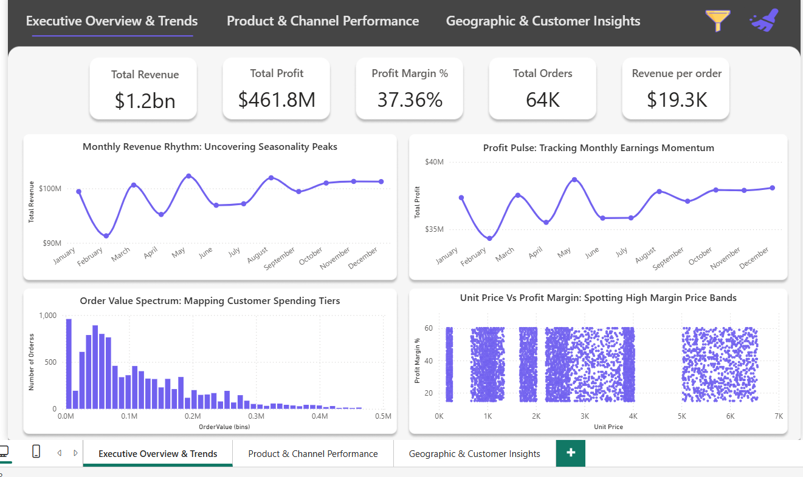
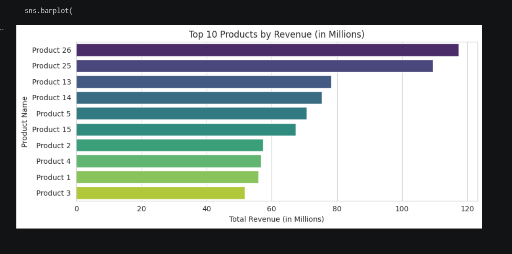
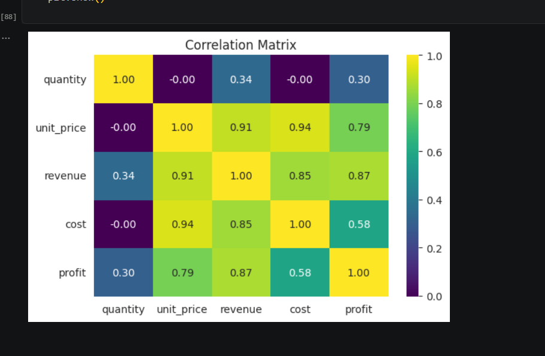
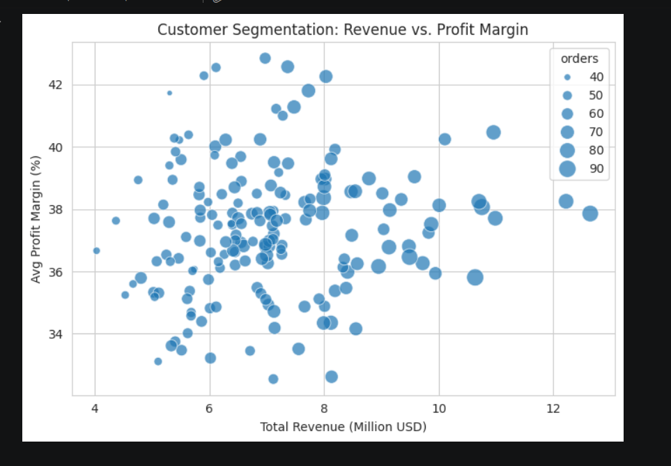

# 📊 Sales Analysis Project

## 🔍 Overview

This project performs an end-to-end analysis of regional sales data across the United States. It combines **Exploratory Data Analysis (EDA)** using Python with an **interactive Power BI dashboard** to uncover business insights and support data-driven decision-making.

---

## 🎯 Objectives

* Analyze sales performance across regions, products, and customers
* Identify key revenue and profit drivers
* Understand seasonal trends and customer behavior
* Build an interactive dashboard for business insights

---

## 🛠️ Tools & Technologies

* **Python** (Pandas, NumPy, Matplotlib, Seaborn)
* **Power BI** (Dashboard & Visualization)
* **Excel** (Raw Data Source)

---

## 📁 Project Structure

```
Sales-Analysis-Project/
│
├── data/
│   ├── raw/                # Original dataset
│   ├── processed/          # Cleaned dataset
│
├── notebooks/              # EDA Notebook
├── powerbi/                # Power BI dashboard file
├── screenshots/            # Visualizations & dashboard images
├── documents/              # Report & presentation
```

---

## 📊 Key Insights

### 📈 Revenue & Profit

* Total Revenue: **$1.2B**
* Total Profit: **$461.8M**
* Profit Margin: **~37%**

### 📦 Product Analysis

* Products **26 & 25** generate the highest revenue
* Lower-tier products contribute minimal revenue

### 👥 Customer Insights

* Revenue is concentrated among top customers
* Significant gap between top and bottom customers

### 🌍 Regional Insights

* **California** is the top-performing state
* **West region** leads in revenue
* Northeast shows growth potential

### 📊 Channel Performance

* Wholesale: Highest contribution (~54%)
* Export: Highest profit margin (~38%)

### 📉 Seasonality

* Peak sales: **May–June**
* Lowest sales: **January**

---

## 📌 Visualizations

### 📊 Dashboard Preview



### 📈 Product Analysis



### 📊 Correlation Heatmap



### 📉 Customer Segmentation



---

## 🚀 Recommendations

* Focus on high-performing products (26 & 25)
* Improve pricing strategy to increase margins
* Expand high-margin export channel
* Target underperforming regions for growth
* Optimize low-performing products

---

## 📎 Project Files

* 📊 Power BI Dashboard: `powerbi/SALES_REPORT.pbix`
* 📓 EDA Notebook: `notebooks/EDA_Regional_Sales_Analysis.ipynb`
* 📄 Report & Presentation: `documents/`

---

## 🎯 Conclusion

This project demonstrates how data analytics can uncover actionable insights in sales performance, helping businesses optimize strategy, improve profitability, and make informed decisions.

---

## 👤 Author

**Mohd Farhan**
 Aspiring Data Analyst

---
